# Devices/Dongles Tested

## Table of Content
* [Legend](#legend) : explanation of special symbols used in the table
* [Test Devices](#test_devices) : devices used for testing functionality
* [USB-C to HDMI](#usbctohdmi) : USB-C to HDMI dongles
* [USB-C Dock](#usbcdock) : USB-C to multiple different downstream ports, commonly referred to as "docks" or "hubs"
* [DP to HDMI adapters](#cableadapter) : DisplayPort (DP) to HDMI adapters/adapter cables

> [!TIP]
>
> 
> **Legend**
>
> 
> `TBD` = "To be done", a dataset that still has to be added, and can be done so with little to no effort or is just
> for a sample to arrive
>
> 
> `?` = "Unknown", a dataset which is unknown and requires more effort to retrieve
>
> **Legend** - datatypes
>
> ❌ = `U+274C` - false
>
> 🟢 = `U+1F7E2` - true

---

## Test devices
**Steam Deck**
- Variants: LCD, OLED (unless specified otherwise)

**Framework 14 AMD**
- OS: Arch Linux
- USB: USB4
- CPU: AMD Ryzen 5 7640U
- GPU: AMD Radeon 760M

**Amazon Basics Thunderbolt 4/USB 4 Pro Docking Station**
- Uplink: 40Gb/s USB-C 4.0
- Downstream USB-C: 2x USB-C 40Gb/s
- NIC: 1x 2.5Gb/s LAN
- USB-A: 3x USB 10Gb/s
- HDMI: HDMI 2.1
- Does **not** support CEC on its own, but can be used to test and verify the functionality of external USB-C to HDMI adapters

**Lenovo ThinkCentre M720q**
- OS: Arch Linux

---
## USB-C Dongles

### USB-C to HDMI - working

| Manufacturer | Name                                                                               | Model | IC                                             | Host Connection | Downstream Connections | Supports CEC | Picture                          | Max Res & Hz                                      | Notes |
|--------------|------------------------------------------------------------------------------------| --- |------------------------------------------------| --- |------------------------|------------|----------------------------------|---------------------------------------------------|----|
| CLUB3D       | USB 3.1 Type C to HDMI 2.0 UHD 4K 60HZ Active Adapter                                                                               |  CAC-2504  | [?](#legend_qst)                               | USB-C | HDMI 2.0    | 🟢         | 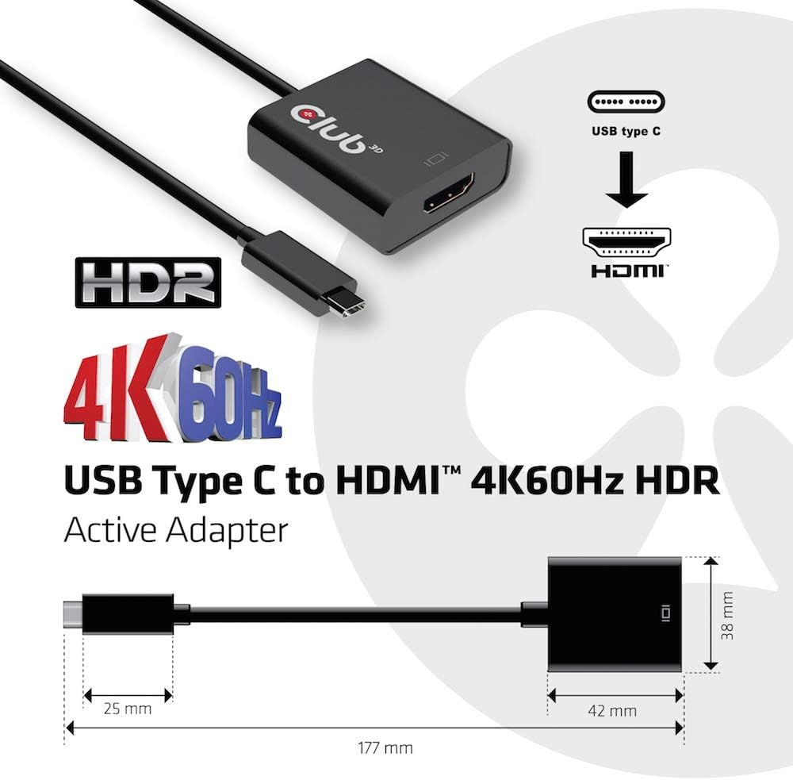 | 4k120 Framework 14 AMD, 1080p120; 4k30 Steam Deck | - |
| StarTech      | USB-C to HDMI Adapter                                                                           | 112B-USBC-HDMI21 | VL103 (USB-DP_with_Aux), PS196 (CEC Tunneling) | USB-C           | HDMI 2.1                                               | 🟢 | 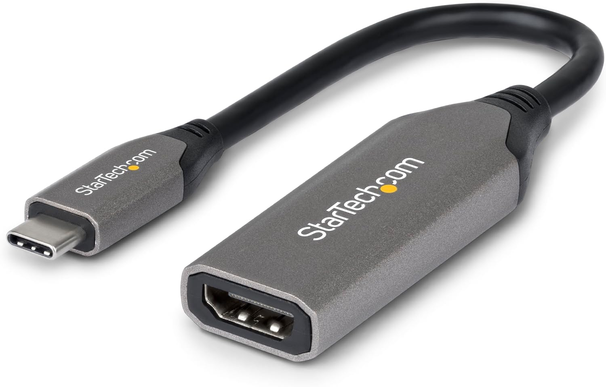   | 4k120 Steam Deck, Framework 14 AMD                | - |

### USB-C to HDMI - non-working

| Manufacturer  | Name                                                                                            | Model                 | IC                                             | Host Connection | Downstream Connections                                 | Supports CEC       | Picture                                                               | Max Res & Hz                       | Notes |
|---------------|-------------------------------------------------------------------------------------------------|-----------------------|------------------------------------------------|-----------------|--------------------------------------------------------|--------------------|-----------------------------------------------------------------------|------------------------------------|-------|
| TUTUO         | N/A                                                                                             | N/A                   | [?](#legend_qst)                               | USB-C           | USB-C PD IN, HDMI, USB-A 3.0                           | ❌                  | 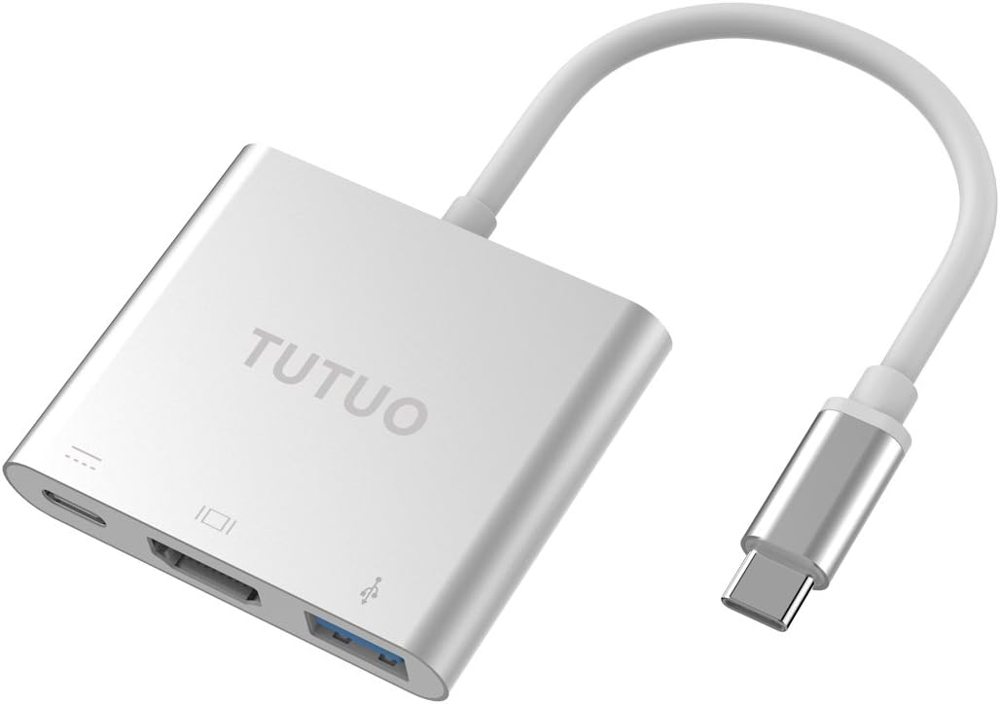                                 | [?](#legend_qst)                   | - |
| Anker         | PowerExpand 6-in-1-USB-C PD Ehternet Hub                                                        | A8365                 | [?](#legend_qst)                               | USB-C           | USB-C PD IN, HDMI, USB-C 5Gb/s, 2x USB-A 5Gb/s         | ❌                  | 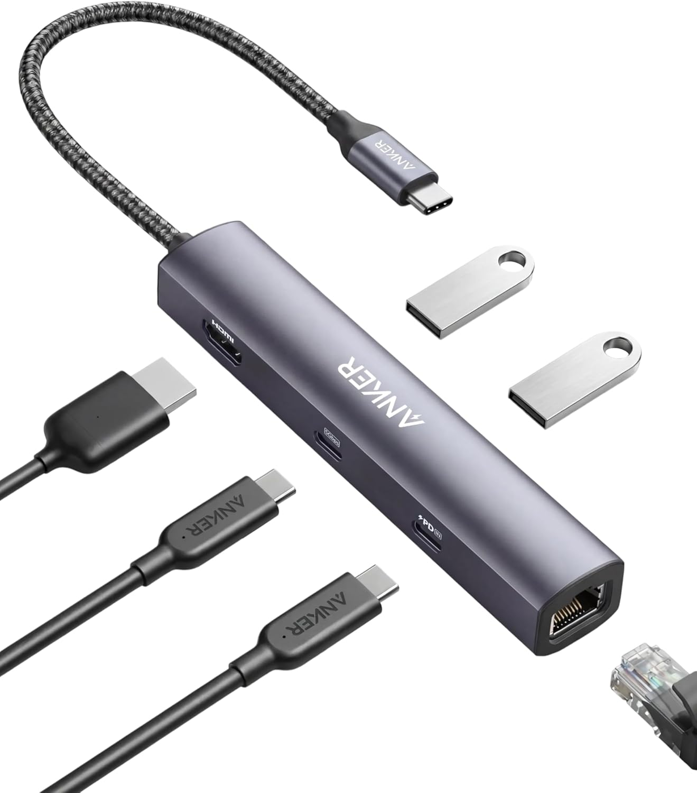                                     | [TBD](#legend_tbd)                 | - |
| Anker         | PowerExpand+ 5-in-1 USB C Ethernet Hub                                                          | A8338  | [?](#legend_qst)                               | USB-C           | HDMI, 3x USB-A, 1Gb/s RJ45                             | ❌                  | 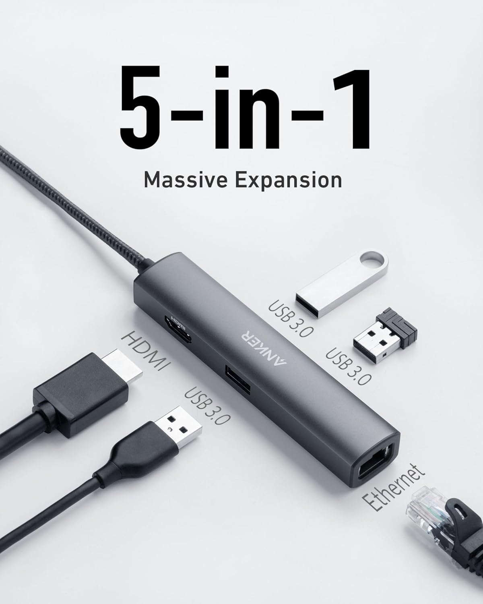                             | [TBD](#legend_tbd)                 | - |
| Anker         | PowerExpand+ USB-C to HDMI Adapter                                                              | A8312                 | [?](#legend_qst)                               | USB-C           | HDMI                                                   | ❌                  | 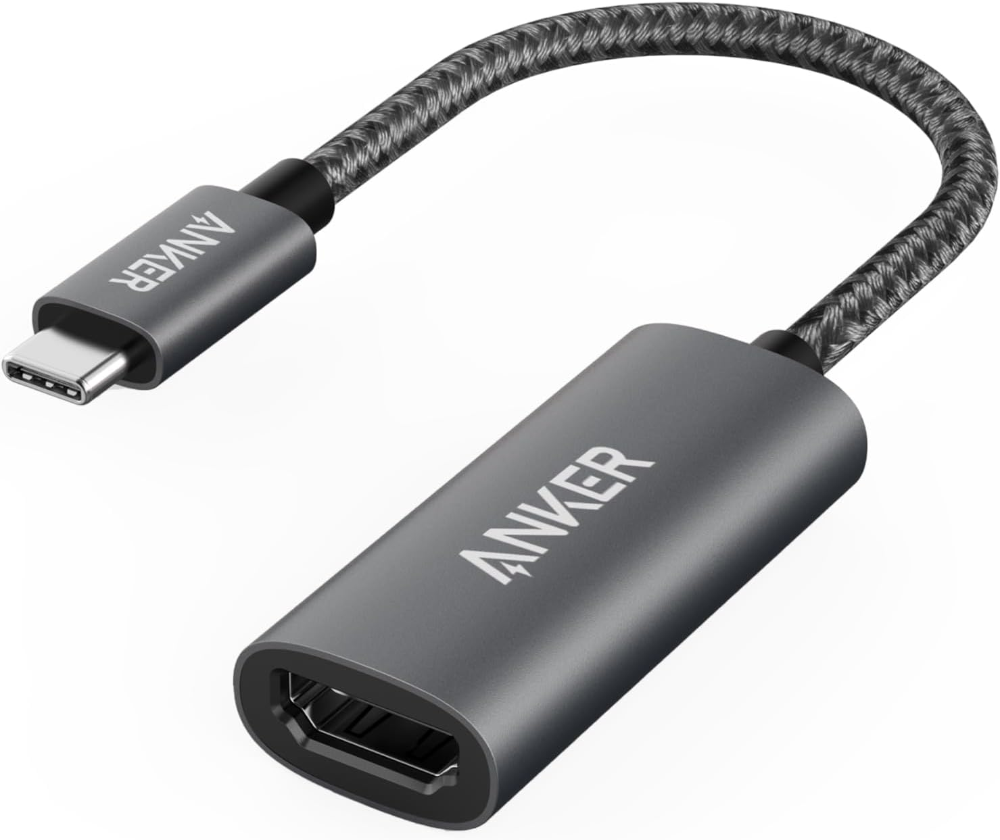                                     | [TBD](#legend_tbd)                 | - |
| Cable Matters | 48Gpbs USB C to HDMI 2.1 Adapter (USB C HDMI Adapter) for 4K 120Hz and 8K 60Hz HDR              | 201388                | [?](#legend_qst)                               | USB-C           | HDMI 2.1                                               | ❌                  | 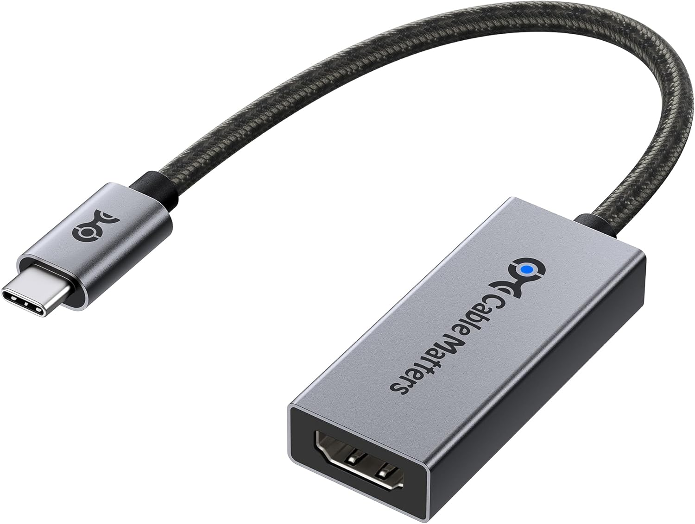               | 4k120 Steam Deck, Framework 14 AMD | - |

---

## DP to HDMI adapters
### DP to HDMI adapters - working
| Manufacturer | Name                                                                                            | Model | IC                                             | Host Connection | Downstream Connections                                         | Supports CEC       | Picture                                      | Max Res & Hz       | Notes                                                                                                                             |
|--------------|-------------------------------------------------------------------------------------------------|-------|------------------------------------------------|-----------------|----------------------------------------------------------------|--------------------|----------------------------------------------|--------------------|-----------------------------------------------------------------------------------------------------------------------------------|
| UGREEN       | UGREEN 8K 60Hz Displayport to HDMI Adapter | DP134 | [?](#legend_qst)     | DP 1.4          | HDMI 2.1 | 🟢 | 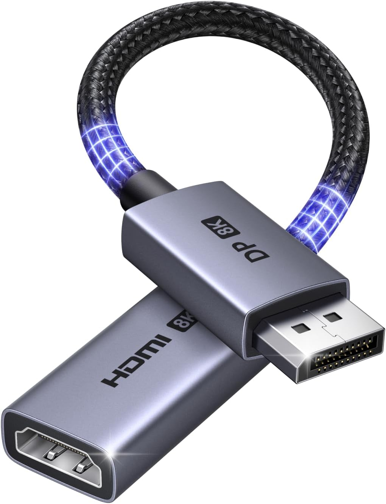 | [TBD](#legend_tbd) | Seems to crash or at least freeze the GPU driver on the Framework when using the Framework DP gen 2 module. Works fine with M720q |

### DP to HDMI adapters - non-working
| Manufacturer  | Name                                                                                            | Model                 | IC                                             | Host Connection | Downstream Connections                                 | Supports CEC       | Picture                                                               | Max Res & Hz                       | Notes |
|---------------|-------------------------------------------------------------------------------------------------|-----------------------|------------------------------------------------|-----------------|--------------------------------------------------------|--------------------|-----------------------------------------------------------------------|------------------------------------|-------|

---

## USB-C Docks
### USB-C Dock - working
| Manufacturer  | Name                                                                                            | Model                 | IC                                             | Host Connection | Downstream Connections                                 | Supports CEC       | Picture                                                               | Max Res & Hz                       | Notes |
|---------------|-------------------------------------------------------------------------------------------------|-----------------------|------------------------------------------------|-----------------|--------------------------------------------------------|--------------------|-----------------------------------------------------------------------|------------------------------------| --- |

### USB-C Dock - non-working
| Manufacturer  | Name                                                                                            | Model                 | IC                 | Host Connection | Downstream Connections                                        | Supports CEC       | Picture                                                               | Max Res & Hz                                                                                     | Notes                                                                                                                                           |
|---------------|-------------------------------------------------------------------------------------------------|-----------------------|--------------------|-----------------|---------------------------------------------------------------|--------------------|-----------------------------------------------------------------------|--------------------------------------------------------------------------------------------------|-------------------------------------------------------------------------------------------------------------------------------------------------|
| Amazon Basics | Thunderbolt 4/USB 4 Pro Docking Station                                                         | B0CPT929ZH / DBD1336  | [TBD](#legend_tbd) | USB-C 40Gb/s    | HDMI 2.1, 3x USB-A 10Gb/s, 2x USB-C 40Gb/s, 1Gb/s RJ45        | ❌ | 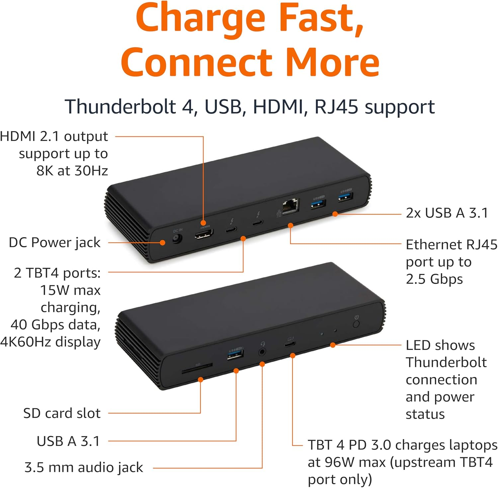                          | 4k120 Framework 14 AMD, Steam Deck                                                               | -                                                                                                                                               |
| iVANKY        | Docking Station for Steam Deck HDMI 2.1 4k144, 1Gbps Ethernet, 3*USB-A 3.0, 100W USB-C Charging | docking_station_4k144 | [?](#legend_qst)   | USB-C           | HDMI 2.1, 3x USB-A 5Gb/s, USB-C PD IN 100W, 1Gb/s RJ45        | ❌ | 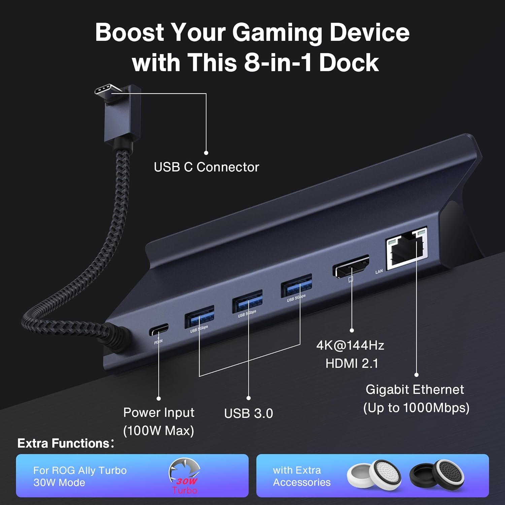 | 4k120 Steam Deck, Framework 14 AMD                                                               | -                                                                                                                                               |
| Sabrent | 6-Port Docking Station for Steam Deck and USB C Devices | DS-SD6P | [?](#legend_qst)     | USB-C           | HDMI 2.0 (DP-Alt), 3x USB-A 3.0, 1x USB-C 3.0, USB-C PD IN 95W | ❌ | 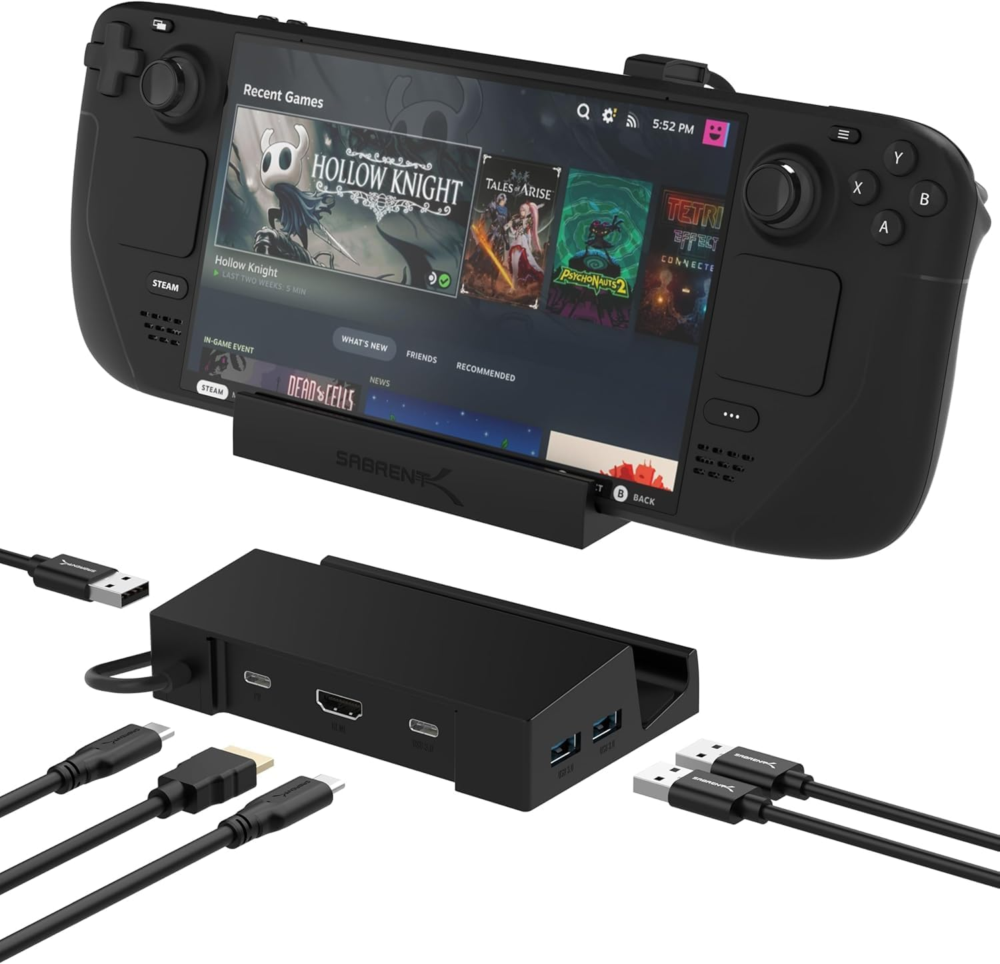 | 4k60 Steam Deck LCD | Dock firmware update required to be OLED compatible. Updater is windows only. Official download link is dead, support sent a google-drive link. |

### USB-C Dock - untested (for docks I plan on testing)
| Manufacturer  | Name                                                                                            | Model                 | IC                 | Host Connection | Downstream Connections                                     | Supports CEC       | Picture                                         | Max Res & Hz                       | Notes |
|---------------|-------------------------------------------------------------------------------------------------|-----------------------|--------------------|-----------------|------------------------------------------------------------|--------------------|-------------------------------------------------|------------------------------------|-------|

